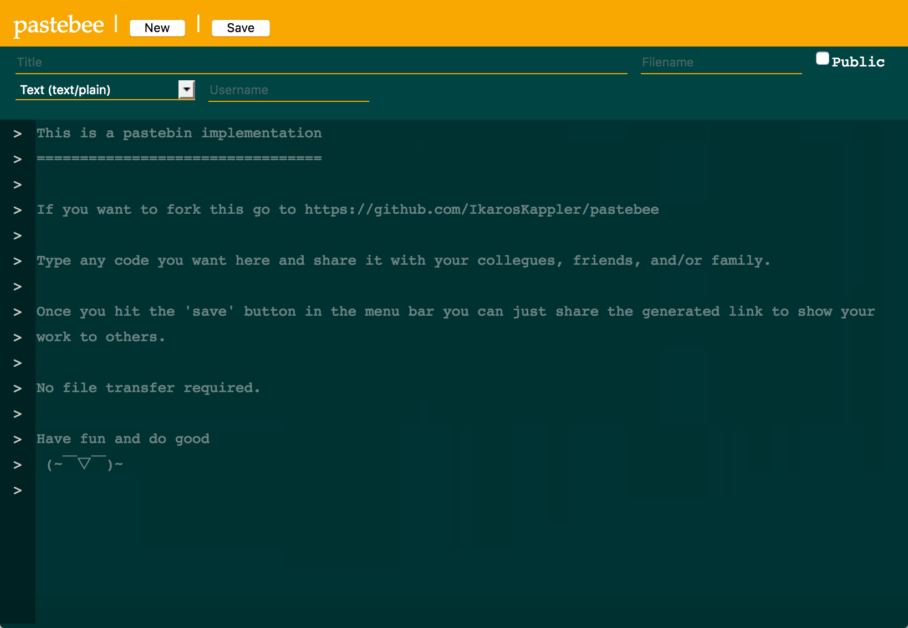

# Pastebee

A PHP pastebin implementation using the illuminate/eloquent library.

See a demo here https://pastebee.func.name/




## Installation

Assume your pastebee installation directory is
```
  /var/www/pastebee/
```


Then go to the installation destination directory and clone the repository
```bash
 $ cd /var/www/pastebee
 $ git clone https://github.com/IkarosKappler/pastebee.git .
```

The main index file is now already in public/index.php.


### Run the installer
You need to have composer installed for this.
```bash
 $ composer install
```


### Create the database (MariaDB or MySQL in this case)
Go to your server terminal, create a new database, user and set CRUD privilegues:
```bash
 # First create the database and grant privileges
 $ mysql -u root -p
   > CREATE DATABASE pastebee;
   > CREATE USER 'pastebee'@'localhost' IDENTIFIED BY 'yourdbpass';
   > INSERT INTO mysql.db (Host,Db,User,Insert_priv,Select_priv,Update_priv,Delete_priv) VALUES('localhost','pastebee','pastebee','Y','Y','Y','Y');
   > FLUSH PRIVILEGES;
   > quit
   
 # Now create the database structure from the supplied SQL file
 $ mysql -u root -p pastebee < database-structure.sql
```


## Webserver configuration
Setup your web server (apache, nginx, ...) to point your public root directory and reload/restart it.
```
 DocumentRoot /var/www/pastebee/public
```


### Requirements
* A web server (Apache, nginx, ...)
* php7
* SQL database (MariaDB, MySQL, ...)
* composer (for installation of illuminate/eloquent)


### Changelog
* 2018-09-05
  * Bugfix: removed editmode from link to parent paste.
  * Changed button text if no parent paste is available.
  * Fixed some color fails in the 'light' theme.
* 2018-08-31
  * Added the 'parent_hash' column to the database, model, controller, DOM and main script.
* 2018-08-30
  * Added 'NOTIFICATION_EMAIL' to the .env file (see .env.example).
  * Added email notification to the create script.
* 2018-08-07
  * Added theming and a second theme (light). See the THEME setting in the example .env file.
* 2018-08-01
  * Added the select criteria 'public=1' to the search/list script (non-public pastes should not be listed).
  * Moved non-public retrieval files (list.php and retrieve.php) from ./public/ to ./inc/
  * Added a 'Download' button.
  * Hiding the save-button when not in edit mode.
* 2018-07-31
  * Changed database text columns from utf8_ci to utf8mb4_ci (can store encoded string values now).
  * Modified the list script: returns a JSON array now (was object before).
  * Extended the request validation; checking for not-null before string length now.
  * Added a search script.
* 2018-07-19
  * Added syntax highlighting (hightlightjs).
* 2018-07-06
  * Initial commit.
  


### References
* I used this tutorial for the Eloquent standalone howto
  * https://code.tutsplus.com/tutorials/using-illuminate-database-with-eloquent-in-your-php-app-without-laravel--cms-27247
* This app uses FontAwesome for toggle icons
  * https://fontawesome.com/