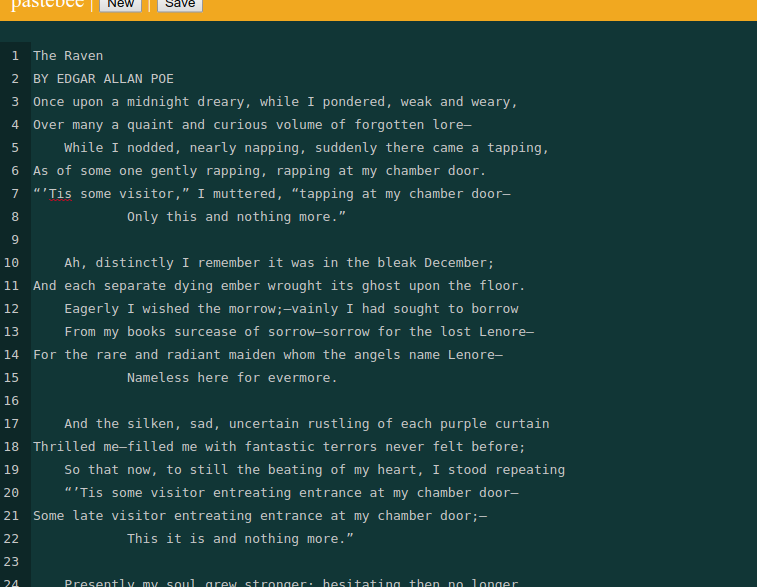

# Pastebee

A PHP pastebin implementation using the illuminate/eloquent library.

See a demo here https://pastebee.func.name/




## Installation

Assume your pastebee installation directory is
```
  /var/www/pastebee/
```


Then go to the installation destination directory and clone the repository
```bash
 $ cd /var/www/pastebee
 $ git clone https://github.com/IkarosKappler/pastebee.git .
```

The main index file is now already in public/index.php.

### Run the installer
You need to have composer installed.
```bash
 $ composer install
```


## Webserver configuration
Setup your web server (apache, nginx, ...) to point your root directory
```
 DocumentRoot /var/www/pastebee/public
```


### I used this tutorial for the Eloquent standalone howto
https://code.tutsplus.com/tutorials/using-illuminate-database-with-eloquent-in-your-php-app-without-laravel--cms-27247
